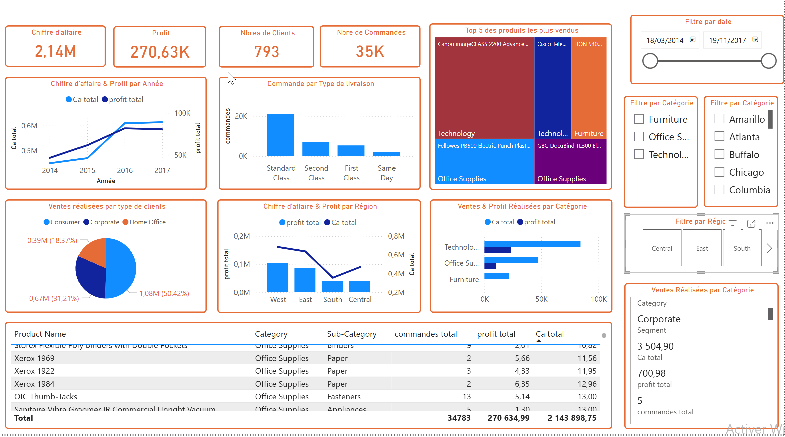

# Dashboard Retail : Analyse des Ventes
## Secteur : Retail & Distribution | Outil : Power BI

## 📌 Énoncé du problème

L’objectif de ce projet est d’analyser les performances commerciales d’une entreprise fictive à travers un **tableau de bord Power BI interactif**, afin d’identifier les leviers de croissance et les axes d’amélioration.

L’entreprise cherche à répondre à plusieurs questions clés :
- Quelles sont les **tendances de ventes et de profits** dans le temps ?  
- Quels sont les **segments de clients les plus rentables** ?  
- Quelles **régions et catégories** contribuent le plus au chiffre d’affaires ?  
- Comment optimiser les **coût de la logistique** et les **performances produits** ?  

Le but est de fournir une **vision claire et exploitable** des données, facilitant la prise de décision.

---

## 🔍 Découverte des données

Le dataset Superstore contient des informations sur :
- Les **ventes**, **profits** et **quantités**,
- Les **catégories** et **sous-catégories** de produits,
- Les **types de clients** et **segments de marché**,
- Les **régions géographiques**, **types de livraison**, et **dates de commande**.

**Source :** Sample Superstore Dataset (fourni sur le site Kaggle).

---

## ⚙️ Étapes du projet

### 1 Nettoyage et transformation des données (ETL)
Réalisé dans **Power Query**, ce processus a permis de rendre les données prêtes pour la modélisation :
- Vérification des doublons, des valeurs manquantes et des incohérences.  
- Transformation des champs de dates.  
- Correction des types de données (dates, nombres, textes).
  

### 2 Création des mesures DAX
- **Chiffre d’affaires total** = SUM(Sales)
- **Profit total** = SUM(Profit)
- **Nombre de commandes** = DISTINCTCOUNT(Order ID)
- **Nombre de clients** = DISTINCTCOUNT(Customer ID)

### 4️⃣ Visualisation et storytelling
- Carte des ventes par région 🗺️  
- Graphique des ventes & profits par année 📈  
- Répartition des ventes par type de client 🧑‍💼  
- Top 5 des produits les plus vendus 🏆  
- Analyse du chiffre d’affaires par catégorie et par segment 🧩

---

## 📊 Insights clés
- Le chiffre d’affaires total atteint **2,14 M$** pour un profit de **270,63 K$**.  
- Les **clients consommateurs (Consumer)** représentent plus de **50 % des ventes**.  
- Les **régions Est et Ouest** concentrent la majorité du chiffre d’affaires.  
- Les produits de la catégorie **Technology** affichent la meilleure marge bénéficiaire.  
- Certaines années présentent un **écart croissant entre les ventes et les profits**, suggérant des coûts ou remises à surveiller.

---

## 💡 Recommandations
- Surveiller la **rentabilité par produit** et ajuster la politique de prix.  
- Mettre en place un **suivi mensuel des marges** pour anticiper les baisses de rentabilité.  
- Concentrer les efforts marketing sur les **segments les plus rentables**.  
- Optimiser la logistique dans les régions à **faible marge**.  
---

## 🧠 Outils, logiciels et langages utilisés
- **Microsoft Power BI** → création du tableau de bord interactif  
- **Power Query** → nettoyage et transformation des données  
- **DAX** → calcul des indicateurs clés  
- **Excel / CSV** → source de données

---

## 📷 Résultat final

Le tableau de bord permet de :
- Suivre en temps réel les ventes et profits par période, région et segment,  
- Identifier les produits à forte marge et les zones à optimiser,  
- Fournir une base décisionnelle fiable et visuelle pour les managers.

---

## 🧾 Auteur
👤 **Nikiema Boubacar**  
Data Analyst
Diplomé en Master Big Data & Cloud Computing 
🌐 [LinkedIn]https://www.linkedin.com/in/boubacar-nikiema/
Youtube: https://www.youtube.com/@BoubacarDataAnalyst

